```{r setup, include=FALSE}
knitr::opts_chunk$set(echo = TRUE)
```

The algorithms and programs described here are in the repository on GitHub:

<https://github.com/andy-aa/butterfly_scan>

The algorithms are implemented in the R programming language[@R-base].
 


## Calculation of the body volume of a butterfly

The algorithm for estimating the volume of the body of a butterfly:

1.  Converting a color image to black and white. Three-channel RGB image →
    Single-channel grayscale image → Single-channel black and white images. When
    converting an image to black and white, it is necessary to use an empirical
    coefficient that is in the range from 0 to 1. The empirical coefficient is a
    color code used to separate all colors in an image into two groups, black
    and white.

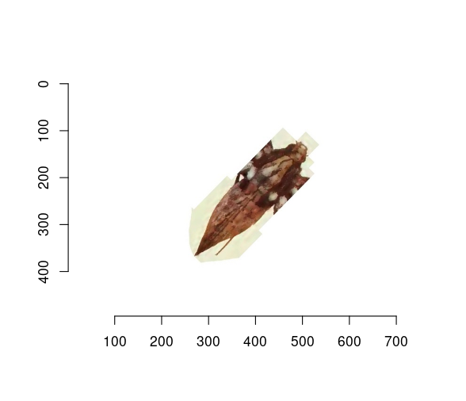{height="150px"}
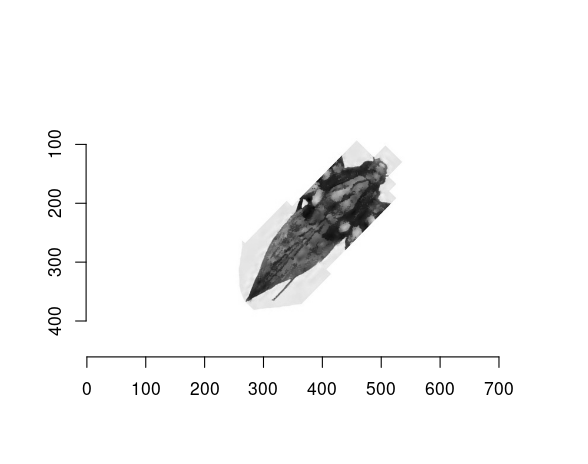{height="150px"} {height="150px"}

2.  Search for the axis of rotation of an arbitrarily oriented body of a
    butterfly. The axis of rotation is a line connecting the two most distant
    points from each other. To reduce the search time, the convex hull of the
    figure is first constructed.

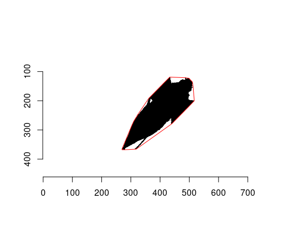{height="300px"}

3.  In the set of points of the convex hull, we need to find two points that
    have a maximum distance function: $d = \sqrt{(x_1-x_2)^2 + (y_1-y_2)^2}$.

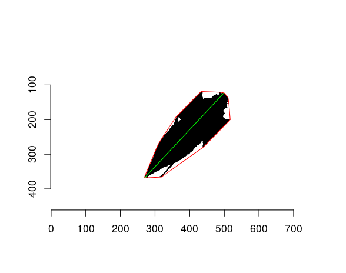{height="300px"}

4.  Finding the angle between the rotation axis and the x-axis. Rotate the image
    so that the rotation axis is perpendicular to the x-axis and parallel to the
    y-axis.

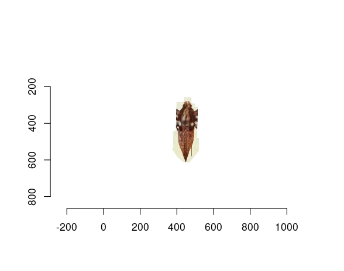{height="150px"} {height="150px"}

5.  Dividing the silhouette (contour) into layers parallel to the x-axis.
    Finding the width of each layer. The width ($w_i$) of a layer is equal to
    the number of pixels in that layer multiplied by the physical size of a
    pixel. The layer height ($h$) is equal to the physical pixel size. Layer
    volume is: $v_i = (w_i / 2) ^2 * pi * h$. The total volume (V) is the sum of
    the volumes of its layers $V = \sum_{i=1}^{n} v_i$.

## Calculation of the moment of inertia of a butterfly wing

The algorithm for estimating the moment of inertia of a butterfly wing:

1.  Converting a color image to black and white.

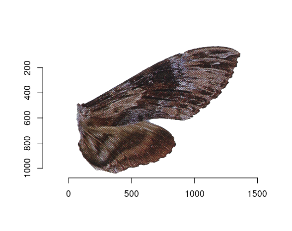{height="150px"}
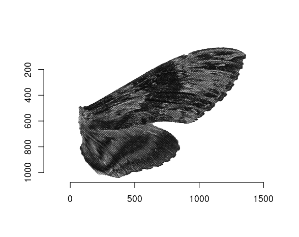{height="150px"}
{height="150px"}

2.  Calculation of the coordinates of the conditional center of mass. The
    classic formula for calculating the center of mass is:
    $\vec r_c= \frac{\sum \limits_i m_i \vec r_i}{\sum \limits_i m_i}$. In the
    case of a two-dimensional object, the formula takes the form:
    $x_c = \frac{\sum_{i=1}^{n} m_i x_i}{\sum_{i=1}^{n} m_i}$ and
    $y_c = \frac{\sum_{i=1}^{n} m_i y_i}{\sum_{i=1}^{n} m_i}$; If we take the
    mass of each point equal to 1, the formulas are noticeably simplified:
    $x_c = \bar{x}$ and $y_c = \bar{y}$.

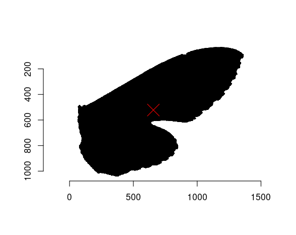{height="150px"}

3.  The classical formula for calculating the ***moment of inertia*** is:
    $J_p = \sum_{i=1}^n m_i r_i^2$, where $m_i$ is the mass of $i$-th point;
    $r_i$ is the distance from the $i$-th point to the axis. If we take the mass
    of each point equal to 1, and for the point of the axis we take the center
    of mass, the formula for ***polar moment of inertia*** will take the form:
    $J_p = \sum_{i=1}^n r_i^2 = \sum_{i=1}^n ((x_i-x_c)^2 + (y_i-y_c)^2)$

4.  In our case ***moment of inertia about the axis*** will be calculated
    relative to the wing attachment line. This is due to the way the wing is
    attached to the body and how it moves during flight [@Insect-flight].
    The formula for calculating the moment of inertia about the axis will take the form::
    $J_a = \sum_{i=1}^n r_i^2 = \sum_{i=1}^n (x_i-x_a)^2$,
    where $x_a$ is the distance to the axis of rotation.
    
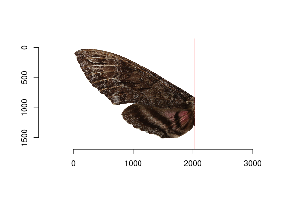{height="200px"}


## Geometric classification and measurement of wing parameters

In order to highlight the characteristic features of the butterfly wings, it is
of interest to approximate the butterfly wing using polygons[@Bronstein2008]. A
simplified representation of a wings shape allows you to highlight the main
geometric properties.

### Left wing of Hemaris diffinis

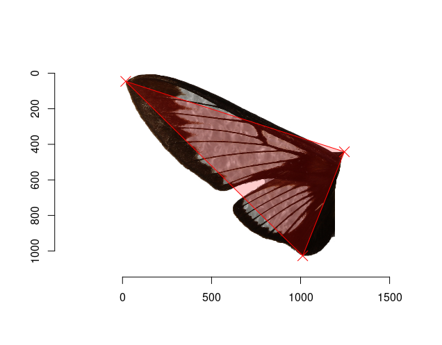{height="300px"}

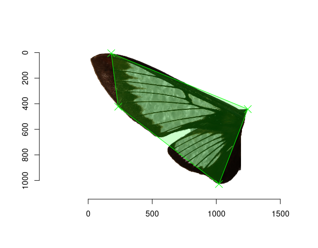{height="300px"}

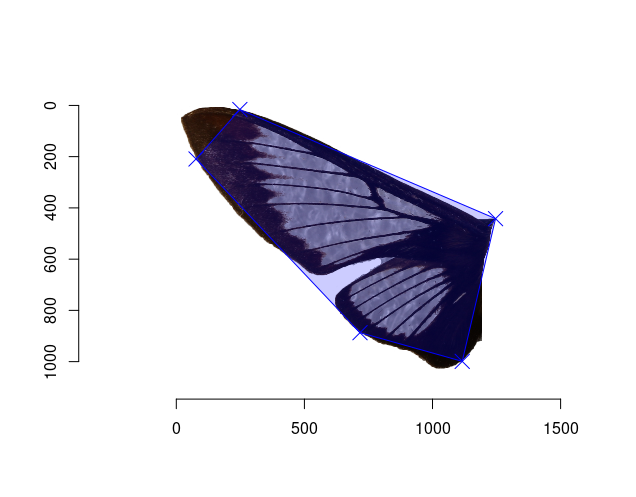{height="300px"}

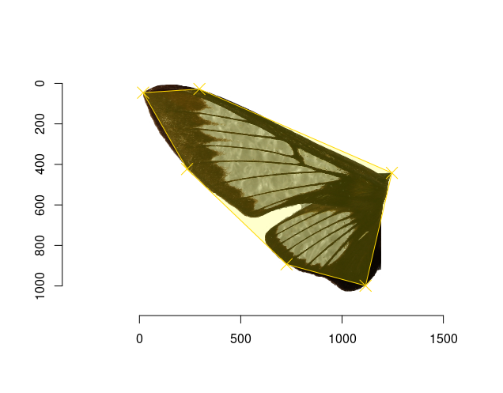{height="300px"}
 
{height="300px"}

### Left wing of Manduca rustica

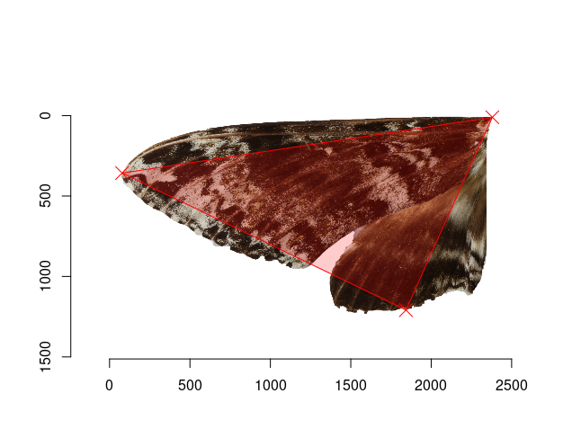{height="300px"}

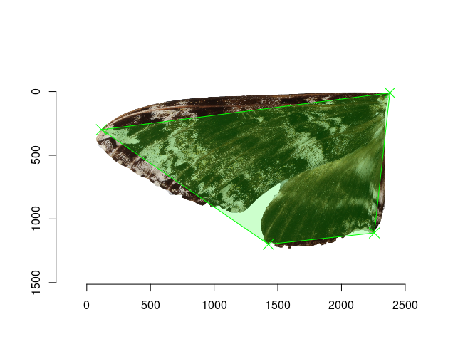{height="300px"}

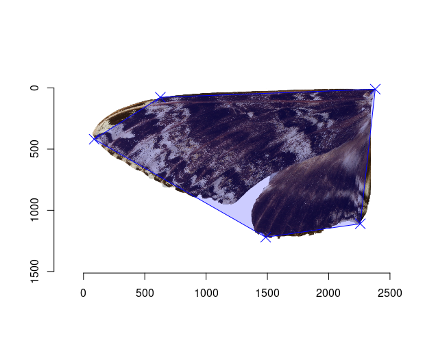{height="300px"}

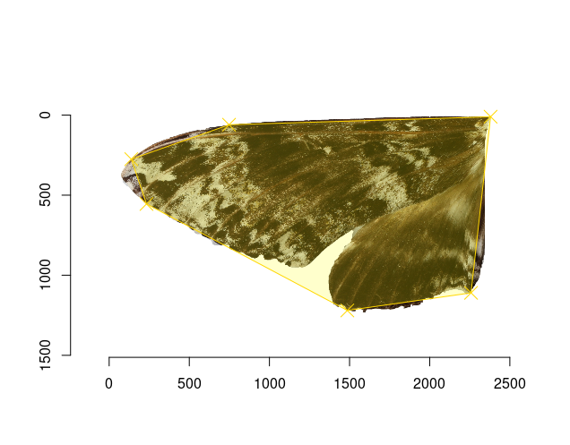{height="300px"}

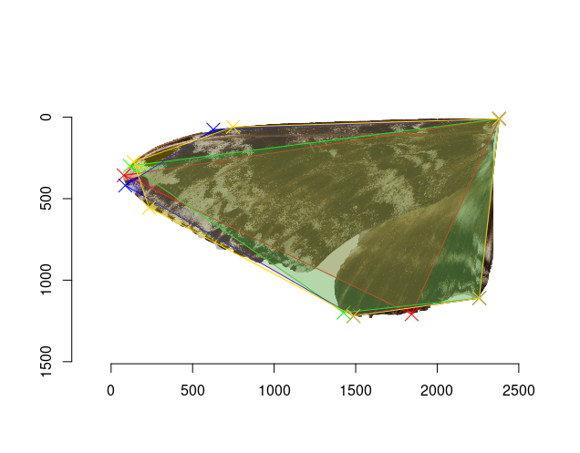{height="300px"}

<!-- [@Triangle-area] -->

<!-- $A = \frac{1}{2} \big| (x_1 - x_3) (y_2 - y_1) - (x_1 - x_2) (y_3 - y_1) \big|$ -->

<!-- [@R-base] -->

### Butterfly wing boundary definition

To find the boundaries of objects in images, one of the most common algorithms is the Canny algorithm [@Canny-edge].

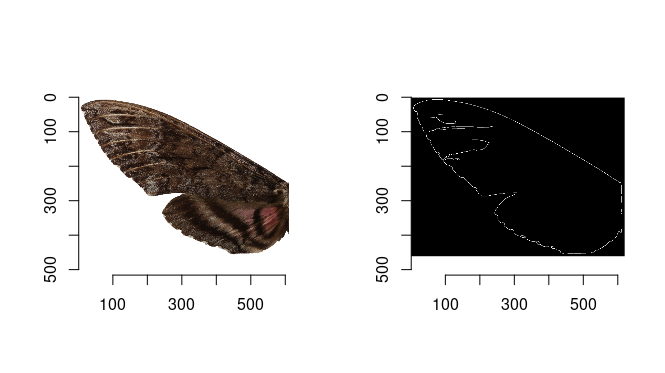{width="700px"}

When using this algorithm, the boundaries will be found not only outside the object but also inside. To avoid this, we can first convert the image to black and white. The disadvantage of using this algorithm is that at the output we have an unordered point cloud, which is the edge of the object.

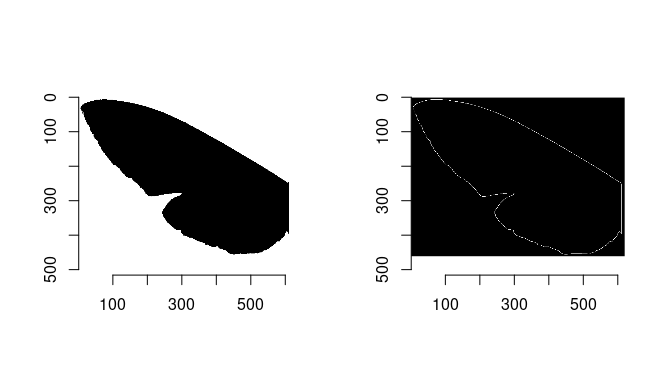{height="700px"}

The boundary of the butterfly wing object is actually a concave hull. One of the algorithms for finding the edges of a concave hull is the Alpha shape algorithm [@Alpha-shape]. 

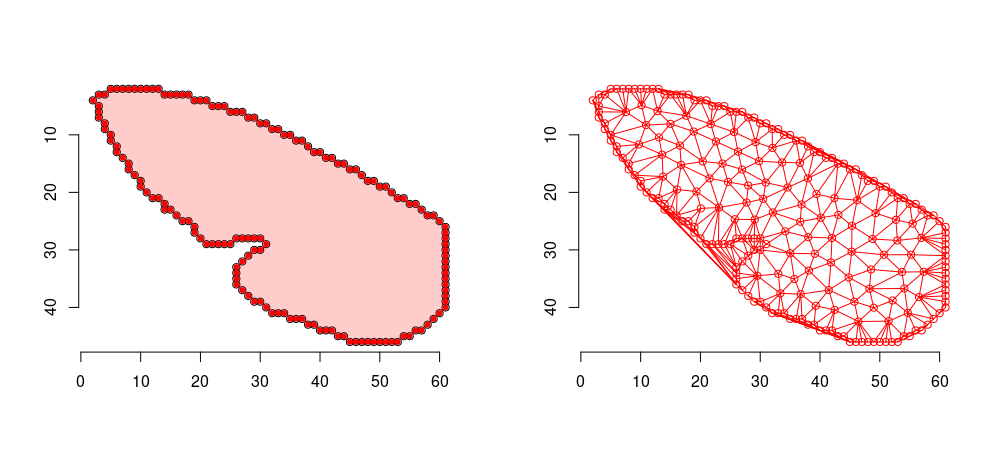{height="700px"}

As a result of the Alpha shape algorithm, we can get a polygon that does not intersect itself and has no holes. To find the area of such polygon, we can use the shoelace Gauss algorithm. [@Shoelace-formula] 

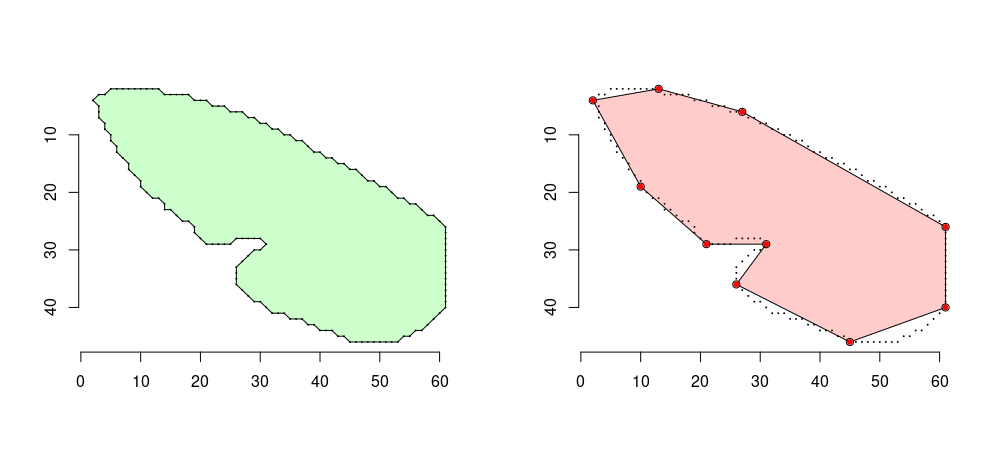{height="700px"}

## To be continued...

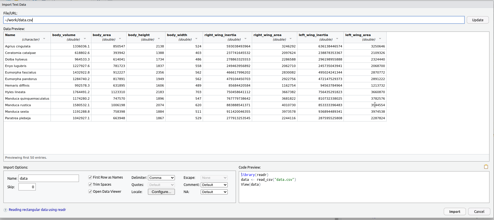{height="400px"}


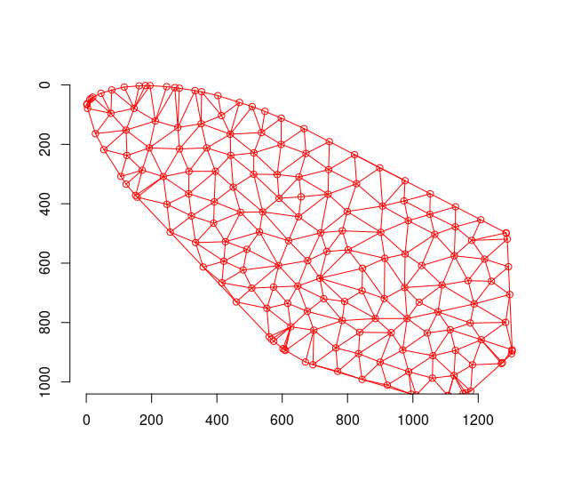{height="250px"}
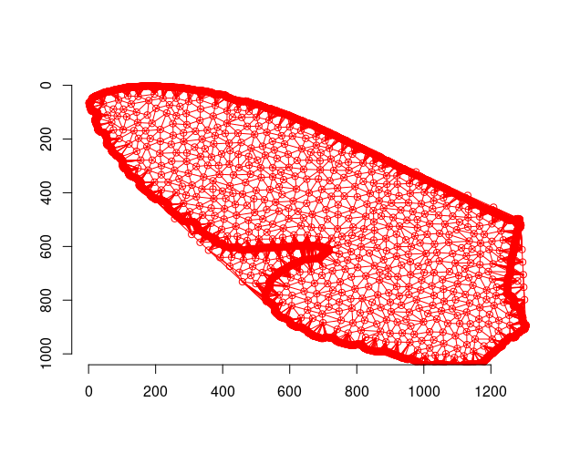{height="250px"}

# References

::: {#refs}
:::
